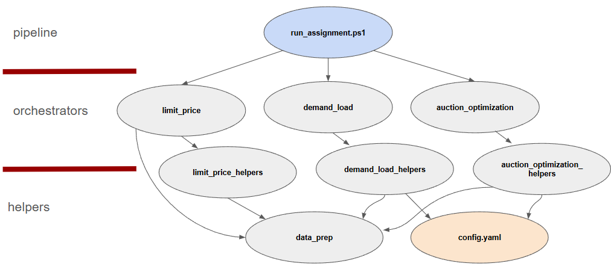

# Limit Order Algorithm for EV Charging Optimization

## Overview

This project implements a comprehensive system for optimizing Electric Vehicle (EV) charging schedules to minimize costs while meeting energy demands. The system combines machine learning models with linear programming to predict electricity prices and optimize charging plans across different time windows.

After running the project pipeline (See Usage section below), a Jupyter notebook `.src\notebook.ipynb` guides the user though the problem, proposed solution, and some key evaluation metrics.

## Features

- **Price Prediction**: Machine learning models (classification and regression) to predict electricity market prices
- **Demand Simulation**: Simulation of EV charging demand patterns based on historical data
- **Cost Optimization**: Linear programming optimization to minimize charging costs while meeting energy requirements
- **Data Processing**: Comprehensive data preprocessing for electricity market data, weather data, and consumption patterns

## Project Structure

```
src/
├── limit_price.py                   # Price prediction main module
├── limit_price_helpers.py           # Price prediction utilities
├── demand_load.py                   # Demand simulation main module
├── demand_load_helpers.py           # Demand simulation utilities
├── auction_optimization.py          # Main optimization orchestration
├── auction_optimization_helpers.py  # Core optimization functions
├── data_prep.py                     # Data preprocessing functions
├── config.yaml                      # Configuration parameters
└── data/
    ├── *.csv                        # Input data files
    ├── models/                      # Trained ML models
    │   ├── ensemble_clf.pkl         # Classification model
    │   └── ensemble_reg.pkl         # Regression model
    └── figures/                     # Generated visualizations
```

The relation across the internal modules is illustrated below.




## Installation

1. Clone the repository
2. Install pandas 2.1.1:

```bash
pip install poetry 2.1.1
```

## Usage

### Complete Optimization Pipeline

In the powershell terminal change directory to where you saved the repository. Then run the full pipeline in the `run_assignment.ps1` in a powershell terminal:

```powershell
.\run_assignment.ps1
```

This runs all the individual components and makes sure that you have all the necessary dependencies for the package.

### Individual Components

#### Price Prediction
```powershell
poetry run python src/limit_price.py
```

#### Demand Simulation
```powershell
poetry run python src/demand_load.py
```

#### Custom Optimization
```powershell
poetry run python src/auction_optimization.py
```

## Configuration
Key parameters can be adjusted in `config.yaml`:

- `TAU`: Risk tolerance parameter for expected cost calculations
- Model training parameters
- Data file paths
- Optimization constraints

## Data Requirements

The system expects the following data files in the `src/data` directory:

- **Electricity Market Data**: ESETT export files for imbalance prices, production, and consumption
- **Energy Price Data**: GUI energy price files
- **Weather Data**: Ninja weather data for Stockholm
- **Simulation Results**: `v_max.csv` (charging capacities) and `total_demand.csv`

## Algorithm Details

### Price Prediction
1. **Classification Model**: Predicts probability of positive price gains
2. **Regression Model**: Estimates magnitude of price gains
3. **Expected Cost Calculation**: Combines predictions with risk tolerance factor

### Optimization
- **Objective**: Minimize total charging cost over night sessions (16:00-09:00)
- **Constraints**: 
  - Total energy demand must be met
  - Hourly charging cannot exceed maximum capacity (`v_max`)
  - Non-negative charging volumes
- **Method**: Linear programming using scipy's `linprog` with HiGHS solver

### Night Session Definition
Optimization runs for charging sessions from 16:00 to 9:59 (next day), representing typical overnight EV charging patterns.

## Output

The system generates:
- `optimized_charging_schedule.csv`: Hourly charging schedule with costs and optimization results
- Visualization plots in the `figures/` directory
- Trained models saved in `models/` directory

***Caveat:*** The algorithm makes use of hyperparameter optimization using hyperopt. This package is based on a sequential mode-based optimization of hyperparameters. Due to the relatively low number of maximum evaluations (`max_evals`), the ML models trained might have small differences across runs. For this reason, when evaluating in the `notebook.ipynb` it is possible that the regression model statistics (e.g., F-stat, $R^2$, etc.) and actual backtested PnL will be slightly different. Additionally, the low number of Monte Carlo simulations may result in an extra some source of differences across runs. This can easily be corrected by increasing the `max_evals` parameter of HyperOpt and the number of Monte Carlo simulations, but that would require a longer training time.

## Logging

All modules include comprehensive logging to track:
- Data loading and preprocessing steps
- Model training and prediction results
- Optimization progress and results
- Error handling and warnings

## Dependencies

All dependencies are listed in `pyproject.toml` 

## Error Handling

The system includes robust error handling for, among other:
- Missing data files
- Model loading failures
- Optimization convergence issues
- Data validation errors

## Contact

This package was developed as a coding case study by Francisco Botero (francisco@boterobernal.com). 
